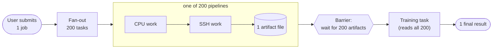

# Workflow Lab

> **TL;DR** — A learning lab that simulates an ML-style job pipeline:
> **1 job → 200 parallel (CPU + SSH) tasks → 200 artifact files → 1 training step → 1 result.**
> The work is fake (`sleep` + `touch`). The point is the **scheduler** around it — fair multi-user dispatch, lease-based crash recovery, and barrier synchronisation.

## What a job looks like

Full walkthrough: [`docs/01-domain/what-a-job-does.md`](./docs/01-domain/what-a-job-does.md).

## Origin

This started as an **onsite system-design interview question** at a startup. The brief: under a **fixed CPU budget**, schedule work such that **one user submitting hundreds of jobs cannot block other users from making progress**. That is fairness across users — not FIFO, not static priority — and a plain message queue can't deliver it: a FIFO queue's "next" is decided at enqueue time, but fairness needs the *current* per-user running count to influence each next pick.

I built this lab out of curiosity to see what a correct solution actually looks like — and then kept going to study what happens when pieces of it crash: lease-based recovery, the reaper, atomic-claim, timeout vs. heartbeat, multi-process isolation. The interview problem is the seed; the resilience work is the rabbit hole.

## Stack

Next.js 15 (App Router) · Postgres · Redis + BullMQ · pm2 supervisor · TypeScript (strict) · Tailwind · raw `pg` (no ORM — the SQL is the point of this lab).

## Where to go next

| If you want to… | Read |
|---|---|
| Run it (5 min) | [`docs/02-run/quickstart.md`](./docs/02-run/quickstart.md) |
| See the chaos demo scenarios | [`docs/02-run/demo-scenarios.md`](./docs/02-run/demo-scenarios.md) |
| Understand the design (why this, not FIFO) | [`docs/03-design/`](./docs/03-design/) |
| See architectural decisions | [`docs/adr/`](./docs/adr/) |
| Read the full canonical spec (agent-readable) | [`SPEC.md`](./SPEC.md) |
