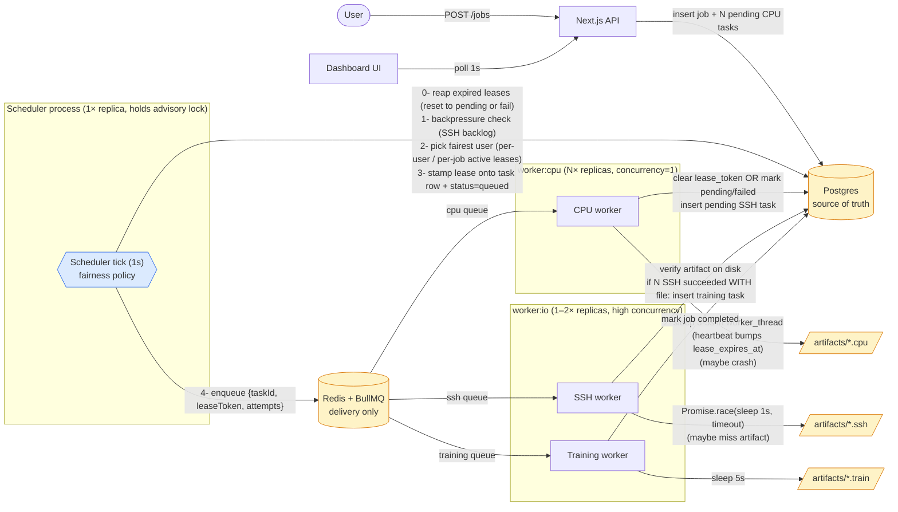

# Workflow Lab — Specification

> **Note on this document.** SPEC.md is the canonical, single-file specification used by agentic workflows (spec-driven development, planning agents). It is intentionally long because it is read by agents that benefit from co-located context. **For human reading, start at [`README.md`](./README.md) and [`docs/`](./docs/) — those are organised by audience and visualised with diagrams.** When the design changes, treat this file as the source of truth and update the human-facing `docs/` views afterwards.

## Goal and scope

### 1. Objective

Build a simulated job-orchestration system that demonstrates **fair multi-user scheduling** under a bounded global resource pool. The point is not the work itself (CPU / SSH / training are all simulated with `sleep` + fake files) — the point is to learn how a scheduler enforces fairness across users when a single FIFO queue would not.

**Target user:** one developer (the author) using this as a learning lab to understand the separation between *queue as delivery mechanism* and *scheduler as policy*.

**Problem solved:** when user A submits 200 tasks before user B submits 1 task, naive FIFO means B waits behind 200 of A's tasks. This system shows how to make B's task interleave fairly.

---

### 2. Scope (one feature only)

A user submits a **job**. The system produces **N pipelines per job** (default 200, configurable via `PIPELINES_PER_JOB` env var). Each pipeline is:

```
CPU task ──→ SSH-like task ──┐
CPU task ──→ SSH-like task ──┤
   ... (N of these) ...      ├──→ (barrier: all N SSH done) ──→ Training task ──→ Job done
CPU task ──→ SSH-like task ──┘
```

Out of scope: real SSH, real ML training, retries, auth, persistence beyond Postgres, horizontal worker scaling, autoscaling, priority tiers.

---

## System design

### 3. Architecture

#### 3.1 Components

| Component | Responsibility |
|---|---|
| **Next.js app** | API routes (`/api/jobs`, `/api/jobs/:id`) + dashboard UI |
| **Postgres** | Source of truth: `users`, `jobs`, `tasks` (lease state lives on `tasks`), `artifacts` |
| **Redis + BullMQ** | Execution delivery only — `cpu`, `ssh`, `training` queues |
| **Scheduler process** | Single replica. Holds the advisory lock (§3.9). Periodic loop: picks pending tasks fairly, stamps a fresh lease onto the task row, enqueues to BullMQ. |
| **Worker processes** | Replicated. `WORKER_ROLE=cpu` runs the CPU BullMQ worker (one process per CPU slot, in-process concurrency 1). `WORKER_ROLE=io` runs SSH + training BullMQ workers with higher in-process concurrency. See §13 for the rationale. |



Key separation: **DB holds policy state (pending tasks, leases)**; **Redis only delivers already-decided work**. The scheduler is the single point where fairness is enforced.

#### 3.2 Critical design rule

**DB is source of truth. BullMQ is delivery, not policy.**

Do NOT enqueue all `PIPELINES_PER_JOB` CPU tasks at job-creation time. Tasks live in DB as `pending`. The scheduler decides who enters the queue.

```
POST /jobs                 →  insert job + N pending CPU tasks in DB (N = PIPELINES_PER_JOB)
scheduler tick (every 1s)  →  find active users → pick user with fewest running tasks
                              → pick one of their pending CPU tasks → create lease
                              → enqueue to BullMQ cpu queue
cpu worker                 →  sleep 3-5s → write artifact file → release lease
                              → insert pending SSH task in DB
ssh worker                 →  sleep 1s → write result file → release lease (if SSH leased)
                              → if N artifact rows exist for this job's SSH tasks → insert training task
training worker            →  sleep 5s → mark job done
```

#### 3.3 Fairness algorithm

Three distinct counts of "active leases" feed the fairness decision (do not confuse them):

- **Global active count of a kind** — total active leases of that kind across all users. Gates how many slots are free this tick (`free = GLOBAL_*_SLOTS − used`).
- **Per-user active count of a kind** — that user's currently-leased tasks of the given kind. The primary fairness key.
- **Per-job active count of a kind** — that job's currently-leased tasks of the given kind. The secondary fairness key, used so two concurrent jobs from the same user interleave instead of the older job draining before the newer one starts.

By construction, the global count equals the sum of all per-user counts, and a user's count equals the sum of that user's per-job counts. An "active lease" means a `tasks` row with `lease_token IS NOT NULL` (§3.4) — there is no separate leases table.

**Per-tick procedure** (single scheduler instance, see §3.9):

1. Reap expired leases (§3.6).
2. Apply backpressure: if the SSH backlog is at or above threshold, skip CPU dispatch this tick (§3.8). SSH and training dispatch always run.
3. For each kind in turn, compute `free = GLOBAL_*_SLOTS − active_count(kind)`. If `free ≤ 0`, skip this kind.
4. Otherwise, repeat up to `free` times: pick the fairest pending task of this kind (criteria below), and in **one atomic step** flip it from `pending` to `queued`, stamp a fresh `lease_token`, set `lease_expires_at = now() + LEASE_TTL_MS`, and set `lease_heartbeat_at = now()`. Then enqueue `{taskId, leaseToken, attempts}` to the BullMQ queue **outside** the DB transaction.

**The atomicity matters**: the pick and the lease stamp are a single statement. After it commits, the very next pick within the same tick sees the just-stamped row in the active counts, so the second decision is made against fresh state. Without that property the scheduler could hand all `free` slots to the same user before any of them is reflected in the counts.

**Pick criterion (4-level tie-break)**, applied against the live active counts:

1. **Smallest per-user active count** (of this kind) for the candidate's user — cross-user fairness.
2. **Smallest per-job active count** (of this kind) for the candidate's job — same-user fairness across concurrent jobs.
3. **Oldest `jobs.created_at`** — when both counts tie, the older job wins.
4. **Oldest `tasks.created_at`** — FIFO within a job.

Concurrency between scheduler decision and parallel writers (heartbeats, finalizes, the reaper) is handled by row-level locking with `SKIP LOCKED` on the candidate row: a row currently being mutated by another transaction is skipped, the next-best candidate is considered, and no decision is delayed waiting on a lock.

**Same-user, multiple jobs**: tasks **interleave** across that user's jobs rather than draining the oldest job to completion before the next one starts. With one user holding two jobs and `GLOBAL_CPU_SLOTS=4`, the steady-state allocation is ~2 slots per job, not 4-then-4. This is intentional: it keeps a long-running job from blocking a smaller follow-up the same user submits.

**Crash safety of dispatch**: if the scheduler process dies between the dispatch `UPDATE` (which has committed) and `bullmq.cpu.add`, the task is left as `status='queued'` with `lease_token` set but no BullMQ message. The lease expires after `LEASE_TTL_MS`, the reaper resets the task to `pending` (clearing `lease_token`), and the next tick re-dispatches. No special handling needed.

SSH and training tasks use the same algorithm with `GLOBAL_SSH_SLOTS` and `GLOBAL_TRAINING_SLOTS`. SSH and training dispatch are **not** affected by the CPU backpressure gate.

#### 3.4 Data model

```sql
users        (id, name, created_at)

jobs         (id, user_id, status, pipelines_count,
              created_at, completed_at)
              -- status: 'pending' | 'running' | 'completed' | 'failed'
              -- pipelines_count: snapshot of PIPELINES_PER_JOB at job creation.
              --                  Barrier compares against this, not the live env var.

tasks        (id, job_id, user_id, kind, status, parent_task_id,
              attempts, max_attempts, failure_reason,
              lease_token, lease_expires_at, lease_heartbeat_at,
              created_at, started_at, finished_at)
              -- kind: 'cpu' | 'ssh' | 'training'
              -- status: 'pending' | 'queued' | 'running' | 'succeeded' | 'failed'
              -- attempts: int, default 0; incremented atomically when a worker claims it
              -- max_attempts: int, default 3
              -- failure_reason: nullable text ('crash' | 'timeout' | 'missing_artifact' | ...)
              --
              -- Lease state (consolidated onto the task — there is no separate
              -- leases table; see ADR-0001):
              --   lease_token        uuid, NULL when no current owner.
              --                      The single source of truth for "active lease".
              --   lease_expires_at   timestamptz; reaper triggers when this < now()
              --                      while the task is still in ('queued','running').
              --   lease_heartbeat_at timestamptz; bumped by the worker every
              --                      LEASE_HEARTBEAT_MS while the task is running.
              --
              -- UNIQUE INDEX (parent_task_id) WHERE kind='ssh'
              --   → guarantees at most one SSH child per CPU parent (§E1)

artifacts    (id, task_id, path, created_at)
              -- UNIQUE (task_id) → at most one artifact per task; barrier counts this table
```

A pipeline is identified by chaining `parent_task_id`: SSH task's parent = its CPU task; training task has no parent (gated by job-level barrier).

**Why the lease lives on `tasks` instead of a separate table** (ADR-0001): every lease operation (acquire, heartbeat, release, reap) already touches the task row, and a 1:1 child table only added a join with no semantic gain. The `tasks.lease_token IS NOT NULL` predicate is the single, indexable fact "this task currently has an owner". Sparse partial indexes on `(kind, user_id) WHERE lease_token IS NOT NULL` and `(kind, job_id) WHERE lease_token IS NOT NULL` make the §3.3 fairness count subqueries cheap.

**Why `parent_task_id` is `ON DELETE SET NULL`**: deleting a CPU parent leaves its SSH child orphaned but distinguishable. The "exactly one SSH child per CPU parent" invariant from `tasks_ssh_parent_unique_idx` therefore only holds while the parent exists; in the lab we never delete tasks, so the invariant is effectively absolute.

**Why `artifacts` has `UNIQUE (task_id)`**: a retried task (e.g. training that timed out and got reset to pending) must not produce two artifact rows. The second insert fails → optimistic-lock branch handles it (see §3.7).

**Why `jobs.pipelines_count`**: changing `PIPELINES_PER_JOB` between jobs would otherwise corrupt the barrier comparison for in-flight jobs. Snapshot at creation is the only safe option.

#### 3.5 Barrier check

The `artifacts` table is the single source of truth for "did this SSH task actually produce a result". The SSH worker only inserts an `artifacts` row **after** verifying the file exists on disk (§3.7). Therefore the barrier never needs to do filesystem IO — it just counts artifact rows.

When an SSH task transitions to `succeeded` (i.e. the artifact row has just been inserted), the barrier runs **in the same DB transaction as the success finalize**, in this order:

1. **Serialise concurrent finishers of the same job.** Take a row-level lock on the parent job row. Any other SSH worker in the same job that reaches the barrier at the same time blocks here until the first finisher commits. Without this lock, two finishers could both observe `done == pipelines_count` and both insert a training task.
2. **Count completed SSH artifacts of this job.** Join the `artifacts` table to the SSH tasks of this job and count.
3. **Decide whether to fan out to training.** If the count equals the job's snapshotted `pipelines_count` *and* no training task has been inserted yet for this job, insert a single `pending` training task. The "no training task yet" guard is the second line of defence, idempotent against any path that might re-enter the barrier (retries, races the lock didn't quite cover).

**Why on-disk verification lives in the worker, not the barrier:** keeping filesystem IO out of the barrier transaction means the barrier holds a DB lock only for the time it takes to count rows and decide. Filesystem latency never blocks other finishers.

#### 3.6 Lease lifecycle & reaper

Leases are how the scheduler counts "currently running" without trusting workers to be alive. The lease is three columns on the task row (§3.4): `lease_token`, `lease_expires_at`, `lease_heartbeat_at`. `lease_token IS NOT NULL` ↔ the task is owned by some worker right now.

- **Acquire** — the scheduler's dispatch step (§3.3) atomically flips the task from `pending` to `queued`, stamps a fresh random `lease_token`, sets `lease_expires_at = now() + LEASE_TTL_MS`, and sets `lease_heartbeat_at = now()` in a single statement.
- **Heartbeat** — while the task is running, the worker periodically (every `LEASE_HEARTBEAT_MS`, default 5s) bumps both `lease_heartbeat_at` and `lease_expires_at`. The bump is gated on the worker's own `lease_token`: if the lease has been released or replaced (token nulled or rotated by a re-dispatch), the heartbeat is a silent no-op. A stale heartbeat from an abandoned attempt cannot resurrect a released lease.
- **Release** — on success, on terminal failure, or on a retryable failure (resetting the task to `pending`), the worker NULLs all three lease columns in the same UPDATE that writes the new status. Lease release and status change are never two separate writes.
- **Reap** — at the start of every scheduler tick, before dispatch, the scheduler scans for tasks whose `lease_expires_at` has slipped past `now()` while still in status `queued` or `running`. An expired lease means the worker stopped heartbeating (process crash, hang, GC stall longer than the TTL). For each expired row:
  - **Retryable** (`attempts < max_attempts`): status reset to `pending`, `started_at` cleared, all three lease columns nulled. The task becomes available for re-dispatch on the next tick.
  - **Terminal** (attempts exhausted): status set to `failed` with `failure_reason='lease_expired'`, `finished_at` stamped, lease columns nulled. The job-level failure is propagated as well (§3.7).
  Concurrency with parallel reapers / workers is handled by `SKIP LOCKED` on the row scan, so contention never blocks the tick.

The reaper runs **inside the scheduler tick**, not as a separate process — keeping all policy decisions in one place.

**`attempts` is not bumped by the reaper** — the next claim does that. If both the reaper and the claim bumped, an honest worker that resumes after a brief pause and still finalizes successfully (passing the optimistic-lock check, §3.7) would be charged one extra attempt against `max_attempts`. As a side effect, a full `running → pending → queued` cycle preserves `attempts`, which is the diagnostic fingerprint described in `docs/task-lifecycle.md`.

#### 3.7 Failure semantics

Every worker handler follows the same contract. The BullMQ message is a tuple `(taskId, leaseToken, attempts)` — the lease token issued by the scheduler at dispatch and the attempt count at the moment of dispatch. The worker treats that tuple as a fencing token: it must still be authoritative at every DB write, otherwise the write becomes a silent no-op.

The handler runs through these phases:

**1. Atomic claim.** The first DB write is a single conditional UPDATE that flips the task from `queued` to `running`, stamps `started_at`, and increments `attempts` — gated on **all three** of: matching `id`, current `status='queued'`, current `lease_token` equal to the message's token, and current `attempts` equal to the message's attempts. If zero rows update, the worker silently aborts with no side effects. Three independent races are closed by this guard:

- The reaper already reset the task while the message was sitting in BullMQ (status no longer `queued`, lease_token NULLed).
- A parallel worker already claimed it (attempts moved on).
- The lease was reaped *and* re-dispatched, so a different `lease_token` is now on the row (the new dispatch's message will succeed, this stale one won't).

**2. Heartbeat.** Once the claim returns, the worker starts a periodic heartbeat on the lease (§3.6). The heartbeat is itself gated on `lease_token`, so once the worker releases or the row is reaped, it becomes a no-op without needing explicit cancellation.

**3. Run work under a timeout.** The worker races `doWork(taskId)` against a per-kind timeout (`CPU_TIMEOUT_MS` / `SSH_TIMEOUT_MS` / `TRAINING_TIMEOUT_MS`). On timeout, the timeout branch throws — the same path as any other `doWork` exception. `doWork` is the only place chaos can be injected (crash, late completion, missing-artifact); anything outside `doWork` runs unconditionally.

**4. Verify the artifact on disk** (CPU and SSH only). After `doWork` resolves, but **before** any DB write, the worker checks that the artifact file actually exists at the deterministic path for this task. A missing file (e.g. chaos `MISSING_ARTIFACT` or a buggy worker) raises an error and goes through the failure path. Filesystem IO never happens inside a DB transaction.

**5. Finalize success in one transaction.** Inside one DB transaction:

- An optimistic-lock UPDATE flips the task from `running` to `succeeded`, stamps `finished_at`, and NULLs all three lease columns — gated on `attempts = myAttempts` (the value returned by the claim). If zero rows update, the worker raises a `StaleAttemptError` and the transaction rolls back, leaving no artifact row, no child task, and no barrier side effect. The optimistic lock prevents a slow worker from overwriting a task that the reaper has already reset and a second worker has already finished.
- The artifacts row is inserted with `ON CONFLICT (task_id) DO NOTHING` — idempotent under retries that wrote the file before failing.
- A kind-specific side effect runs: CPU inserts the child SSH task (idempotent via `UNIQUE (parent_task_id)`); SSH runs the barrier check (§3.5); training marks the job completed (idempotent via `WHERE status NOT IN ('completed','failed')`).

If any step in the success transaction fails, all of it rolls back together.

**6. Finalize failure in one transaction** (any thrown error from steps 3–5, except `StaleAttemptError` which is already handled). The worker classifies retryability by comparing `myAttempts` to `max_attempts`:

- A retryable failure resets the task to `pending`, records `failure_reason`, and NULLs the lease columns. The next scheduler tick can re-dispatch it.
- A terminal failure flips the task to `failed`, stamps `finished_at`, records the reason, NULLs the lease columns, **and** propagates job-level failure: the parent job is marked `failed` (idempotent guard against already-failed/completed jobs).

Both branches use the same optimistic-lock guard (`attempts = myAttempts AND status = 'running'`). If zero rows update, the reaper got there first — nothing to do, the failure record the reaper wrote (`failure_reason='lease_expired'` or similar) is the authoritative one.

**7. Stop the heartbeat** unconditionally on the way out, success or failure.

**Process-crash path.** A hard crash (`process.exit`, kernel kill, OS panic) skips steps 5–7 entirely. The heartbeat stops automatically because the process is gone, `lease_expires_at` slips past `now()` after one TTL, and the reaper claims the row on its next tick — same outcome as a retryable failure, just driven by the scheduler instead of the worker.

**Why the optimistic lock is non-negotiable.** Without `WHERE attempts = $myAttempts`, a slow worker that finishes after its lease has been reaped and re-dispatched would overwrite the second worker's authoritative state — producing duplicate artifact rows, duplicate SSH children, or a "succeeded" status on a task whose new attempt is still running.

**Job failure propagation rule.** When any CPU/SSH/training task hits permanent `failed`, the parent job is marked `failed` immediately so downstream consumers stop waiting on a barrier that can never fire. Sibling tasks of the same job that are already running are *not* cancelled — they run to natural completion. They simply will not trigger the barrier (success of the failed sibling never happens) or anything else, because the job's terminal status is already set.

#### 3.8 Backpressure (CPU → SSH)

CPU tasks produce SSH tasks. If SSH workers are slow or `GLOBAL_SSH_SLOTS` is small, SSH-side work piles up while CPU work keeps inserting more SSH tasks. The scheduler must not blindly keep producing.

The rule, applied each tick before CPU dispatch: count the SSH backlog as the total number of SSH tasks in any non-terminal state (`pending`, `queued`, or `running`). If that count is at or above `SSH_BACKPRESSURE_THRESHOLD`, skip CPU dispatch for this tick. SSH dispatch and training dispatch are unaffected — only CPU is paused, so the SSH queue continues to drain. Once the backlog drops back below the threshold, CPU dispatch resumes on the next tick.

`SSH_BACKPRESSURE_THRESHOLD` rule of thumb: `2 × GLOBAL_SSH_SLOTS` (with the default `GLOBAL_SSH_SLOTS=4`, the threshold is 8).

**Trade-off (intentional): backpressure is global, not per-user.** If alice's SSH tasks fill the backlog, carol's CPU tasks are also paused even though carol isn't responsible. This sacrifices strict cross-user fairness for system stability — if carol were allowed to push more CPU tasks while the SSH queue was jammed, the SSH backlog would grow unbounded and break every user. Stability wins over fairness in this one place, and only here.

#### 3.9 Single-instance guarantee

The fairness algorithm (§3.3), the reaper (§3.6), and the backpressure check (§3.8) all assume **exactly one scheduler instance** is ticking. Two parallel schedulers would compute the active counts independently against an instant of DB state and could each decide to fill the same free slot, over-allocating against the global cap.

The guarantee is enforced via a Postgres advisory lock keyed on a fixed identifier (`workflow-lab:scheduler`). On scheduler-process startup, before the first tick, the process attempts to acquire this lock. If the lock is already held by another process, the attempt fails: the new process logs an error and exits with status 1. If acquired, the process holds the lock for its entire lifetime; Postgres releases it automatically when the holding connection closes (graceful shutdown or process death). This makes "single scheduler" a runtime invariant, not a polite assumption — a misconfigured deployment that tries to run two schedulers fails fast at boot.

The single-instance rule applies only to the **scheduler tick loop**. Multiple BullMQ worker processes for the same kind are explicitly supported (and required, for CPU work — see §13).

#### 3.10 BullMQ lock alignment

BullMQ has its own `lockDuration` (default 30s): if a worker holds a job longer than this, BullMQ assumes it died and re-delivers the job to another worker. If our task timeouts approach or exceed `lockDuration`, we get **double delivery** — same problem as a stale-message replay.

Set BullMQ `lockDuration` ≥ `max(*_TIMEOUT_MS) + 5000` (e.g. 70s for a 60s training timeout). Workers extend the BullMQ lock alongside the DB lease heartbeat. Our atomic claim (§3.7) is the safety net if alignment is wrong, but alignment is the first line of defence.

**Lease TTL is heartbeat-driven, not timeout-driven.** `LEASE_TTL_MS` (default 30s) is intentionally smaller than `TRAINING_TIMEOUT_MS` (default 60s) — the rule is "TTL ≥ heartbeat × ~6", not "TTL ≥ max timeout". A live worker bumps `lease_expires_at` every `LEASE_HEARTBEAT_MS`, so task duration can exceed TTL safely as long as heartbeats keep firing. The reaper only kicks in when heartbeats stop (crashed worker, blocked event loop), at which point reclaiming the slot quickly is the desired behaviour. BullMQ `lockDuration`, in contrast, must dominate the longest timeout because it is not heartbeated by the worker handler in the same way.

---

## Public surface

### 4. API

| Method | Path | Body | Returns |
|---|---|---|---|
| `POST` | `/api/users` | `{ name: string }` | `{ id, name }` |
| `POST` | `/api/jobs` | `{ userId: string }` | `{ jobId, status: 'pending', pipelinesCount }` |
| `GET`  | `/api/jobs/:id` | — | `{ id, userId, status, pipelinesCount, progress: { cpu: {done,total,failed}, ssh: {done,total,failed}, training: {done,total,failed} } }` |
| `GET`  | `/api/jobs` | query: `userId?` | list of jobs with progress |
| `GET`  | `/api/users` | — | list with running task counts (for dashboard fairness view) |

**Validation (zod)**:
- `POST /api/jobs`: `userId` must reference an existing user → 404 if not found. No auto-create.
- `PIPELINES_PER_JOB` is read at job-creation time and snapshotted into `jobs.pipelines_count`. Allowed range: `1 ≤ N ≤ 1000`. Reject with 400 if out of range.

User identity: `userId` passed in request body / query. No auth.

---

### 5. Frontend dashboard

One page (`/`):
- Form: pick user (or create new) → submit job
- Live table of jobs with progress bars (CPU / SSH / training counts)
- Live "fairness panel": running CPU task count per user, current global slot usage (e.g. `14/20`)
- Polling-based refresh (every 1s). No websockets.

Production-quality enough to read at a glance; not pixel-perfect.

---

## Operational layout

### 6. Project structure

```
workflow-lab/
  app/                      # Next.js app router
    api/
      jobs/
        route.ts            # POST, GET list
        [id]/route.ts       # GET one
      users/route.ts
    page.tsx                # dashboard
    components/
  lib/
    db.ts                   # postgres client (pg)
    queues.ts               # BullMQ queue definitions
    scheduler.ts            # fairness loop (imported by scheduler/index.ts)
    advisory-lock.ts        # pg_try_advisory_lock wrapper (§3.9)
    barrier.ts              # all-N-SSH-done check
    config.ts               # env-driven knobs
    worker.ts               # claim / heartbeat / finalize helpers
  scheduler/
    index.ts                # entrypoint: advisory lock + scheduler tick loop
  worker/
    index.ts                # entrypoint: BullMQ workers selected by WORKER_ROLE
    role.ts                 # WORKER_ROLE → kinds mapping
    cpu.ts                  # spawns cpu-thread worker_thread; finalizes
    cpu-thread.ts           # synchronous compute, runs inside worker_threads.Worker
    ssh.ts
    training.ts
  db/
    schema.sql              # initial DDL
    migrations/             # if needed
  artifacts/                # fake output files written here (gitignored)
  docker-compose.yml        # postgres + redis
  ecosystem.config.cjs      # pm2 supervisor template (§13)
  package.json
  SPEC.md
  README.md
```

Three runtime process kinds (see `ecosystem.config.cjs` for the pm2 template):
1. `next dev` (or `next start`) — serves API + UI.
2. `pnpm scheduler` — 1× replica. Holds the Postgres advisory lock (§3.9) and runs the scheduler tick loop.
3. `pnpm worker:cpu` — N× replicas (default `GLOBAL_CPU_SLOTS`). Each runs the CPU BullMQ worker with in-process concurrency 1 so one process saturates one core; CPU work runs in a `worker_threads.Worker` so synchronous compute can never block the heartbeat or BullMQ lock-renewal callbacks. See §13.
4. `pnpm worker:io` — 1–2× replicas (default `IO_WORKER_REPLICAS`). Runs the SSH and training BullMQ workers with high in-process concurrency (these are I/O-bound).

Worker code is isolated under `scheduler/` and `worker/` — no Next.js or React imports. Both may import from `lib/`.

#### 6.1 Run modes

Two supported ways to launch the scheduler + workers. Both share the same `.env`, Postgres, and Redis; mode B is mode A with the `worker:*` process count fanned out.

| Mode | Command | Layout | When to use |
|---|---|---|---|
| **A. Manual (dev)** | `pnpm scheduler`, `pnpm worker:cpu`, `pnpm worker:io` (one terminal each) + `pnpm dev` | 1× scheduler + 1× `worker:cpu` + 1× `worker:io` | Day-to-day development; §9.1, §9.3, §9.4. A crashed worker must be restarted manually — `pnpm worker:cpu:watch` / `pnpm worker:io:watch` provide a poor-man's auto-restart loop. |
| **B. Supervised (pm2)** | `pnpm supervisor:start` (foreground) or `pnpm supervisor:start:bg` | 1× scheduler + N× `worker:cpu` (N = `GLOBAL_CPU_SLOTS`) + M× `worker:io` (M = `IO_WORKER_REPLICAS`), pm2 auto-restarts crashed processes | §9.2 (`process.exit(1)` chaos — pm2 brings the cpu replica back so the reaper can reclaim its lease), §9.5 (multi-user fairness across replicas), §9.6 (backpressure under real fan-out). |

`ecosystem.config.cjs` is the pm2 template. It reads `GLOBAL_CPU_SLOTS` and `IO_WORKER_REPLICAS` from `.env` to size the replica counts and forces `CPU_WORKER_CONCURRENCY=1` per cpu replica via env override (one process per slot is the §13 invariant).

Mode A is correct for verifying the algorithm; Mode B is correct for verifying the deployment shape. Scenarios that require process-level death-recovery or multi-replica scheduling (§9.2, §9.5, §9.6) only behave correctly under Mode B.

---

### 7. Configurable parameters (env)

The values below are the project's committed defaults (see `.env.example`). `4×4` is intentionally small so a developer laptop can run the full multi-process layout described in §13 without exhausting cores. Scale `GLOBAL_CPU_SLOTS`, `GLOBAL_SSH_SLOTS`, and `IO_WORKER_REPLICAS` together when targeting a larger machine.

```
# Global slot pools — caps on simultaneous active leases per kind.
GLOBAL_CPU_SLOTS=4
GLOBAL_SSH_SLOTS=4
GLOBAL_TRAINING_SLOTS=4

# Process-supervisor knobs (consumed by ecosystem.config.cjs, §13).
# cpu replicas come from GLOBAL_CPU_SLOTS so deployed processes match slot caps.
IO_WORKER_REPLICAS=4

# Per-kind in-process BullMQ concurrency.
# In a single-replica deployment these must equal GLOBAL_*_SLOTS (otherwise the
# scheduler dispatches messages whose DB leases expire while waiting in Redis
# for a free BullMQ slot). Under the supervisor split, CPU_WORKER_CONCURRENCY
# is forced to 1 inside each cpu replica via env override.
CPU_WORKER_CONCURRENCY=4
SSH_WORKER_CONCURRENCY=1
TRAINING_WORKER_CONCURRENCY=4

CPU_SLEEP_MIN_MS=3000
CPU_SLEEP_MAX_MS=5000
SSH_SLEEP_MS=1000
TRAINING_SLEEP_MS=5000

PIPELINES_PER_JOB=200            # snapshotted onto jobs.pipelines_count at creation; range 1..1000
SCHEDULER_TICK_MS=1000

# Lease / heartbeat (§3.6, §3.10)
# TTL must be a comfortable multiple of the heartbeat interval (here 6×). A live worker
# bumps lease_expires_at every LEASE_HEARTBEAT_MS, so task duration can exceed TTL
# safely as long as heartbeats keep firing. Reaper only kicks in when heartbeats stop.
LEASE_TTL_MS=30000
LEASE_HEARTBEAT_MS=5000

# Per-kind timeouts (used by withTimeout in the worker)
CPU_TIMEOUT_MS=15000
SSH_TIMEOUT_MS=5000
TRAINING_TIMEOUT_MS=60000

# BullMQ lock duration (must be >= max(*_TIMEOUT_MS) + 5000 to avoid double-delivery, §3.10)
BULLMQ_LOCK_DURATION_MS=70000

# Retries
MAX_ATTEMPTS=3

# Backpressure (CPU paused when SSH backlog exceeds this)
# Rule of thumb: 2 × GLOBAL_SSH_SLOTS. With GLOBAL_SSH_SLOTS=4 → 8.
SSH_BACKPRESSURE_THRESHOLD=8

# Chaos knobs (default 0 = off; set to inject failures)
CHAOS_CPU_CRASH_RATE=0.02        # CPU thread: process.exit mid-run
CHAOS_SSH_TIMEOUT_RATE=0.02      # SSH task: sleep past SSH_TIMEOUT_MS
CHAOS_SSH_MISSING_ARTIFACT_RATE=0.05  # SSH task: succeed without writing file

DATABASE_URL=postgres://...
REDIS_URL=redis://localhost:6379
ARTIFACTS_DIR=./artifacts
```

---

## Conventions and validation

### 8. Code style

- **TypeScript strict mode** everywhere.
- Next.js **App Router** (not Pages Router).
- DB access via **`pg`** with hand-written SQL. No ORM. The lease/lock semantics are the point of this lab — they must be visible.
- Package manager: **pnpm**.
- **Single `package.json`** at repo root — Next.js app and worker share `lib/` directly. Not a workspace/monorepo. (Decision: the learning target is the scheduler, not build tooling. Easy to split later if needed.)
- No ORM-heavy abstractions in scheduler — the scheduler is the point of this exercise; keep its SQL readable.
- Worker code isolated under `worker/` — no Next.js / React imports there. May import from `lib/`.
- UI: **Tailwind CSS**. No component library.
- Errors: `console.error` + DB status update is fine. No structured logger needed.

---

### 9. Testing strategy

**No automated tests for this lab** (per user). Manual verification consists of one happy-path scenario plus five chaos scenarios. Each chaos scenario maps to one chaos env var; flip it on, run, observe.

#### 9.0 Setup
1. `docker-compose up -d` (postgres + redis).
2. `pnpm db:reset` (or `psql -f db/schema.sql`).
3. Pick a run mode from §6.1 — Mode A (manual) for §9.1/§9.3/§9.4, Mode B (pm2 supervisor) for §9.2/§9.5/§9.6.
4. `pnpm dev` (separate terminal) — Next.js app + dashboard.
5. Open dashboard, create users alice/bob/carol.

#### 9.1 Happy path (all chaos knobs = 0)
- Submit a job as alice. All 200 pipelines complete; one training artifact written; `jobs.status = completed`.

#### 9.2 Scenario 1 — Worker crash (CPU)
- Set `CHAOS_CPU_CRASH_RATE=0.10`.
- Submit job. ~10% of CPU tasks will `process.exit(1)` mid-sleep (kills the whole worker → restart it manually, or use `nodemon`).
- **Expect**: leases of crashed tasks expire after `LEASE_TTL_MS`; reaper sets them back to `pending`; they're re-dispatched on a later tick. `attempts` increments. Job still completes.

#### 9.3 Scenario 2 — SSH timeout
- Set `CHAOS_SSH_TIMEOUT_RATE=0.05`.
- ~5% of SSH tasks sleep past `SSH_TIMEOUT_MS`.
- **Expect**: `Promise.race` rejects with timeout; task marked `pending` (retryable) or `failed` (after `MAX_ATTEMPTS`). Worker is **not** stuck. Lease released cleanly. Job completes only if every SSH eventually succeeds.

#### 9.4 Scenario 3 — Artifact missing
- Set `CHAOS_SSH_MISSING_ARTIFACT_RATE=0.05`.
- 5% of SSH tasks return without writing the result file.
- **Expect**: `verifyArtifact()` throws → task → retry. Even if a buggy worker bypassed verification, the **barrier check counts only SSH tasks with on-disk artifacts**, so training never starts prematurely.

#### 9.5 Scenario 4 — Multi-user fairness
- Submit jobs from alice, bob, carol within ~2 seconds of each other.
- **Expect**: dashboard's fairness panel shows running CPU counts converging — no user is starved. Approximate steady state: each user gets `floor(GLOBAL_CPU_SLOTS / active_users)` or `ceil(GLOBAL_CPU_SLOTS / active_users)` slots, i.e. counts within 1 of each other. With the default `GLOBAL_CPU_SLOTS=4` and 3 users this is a 2/1/1 split (which user holds the extra slot rotates as tasks finish). Scaled up to `GLOBAL_CPU_SLOTS=20` it would be ~7/7/6.

#### 9.6 Scenario 5 — Backpressure
- Lower `GLOBAL_SSH_SLOTS=5` and `SSH_BACKPRESSURE_THRESHOLD=15`.
- Submit a job. CPU tasks produce SSH tasks faster than 5 SSH slots can drain.
- **Expect**: once SSH backlog (pending+queued+running) hits 15, scheduler stops dispatching new CPU tasks; SSH catches up; CPU resumes. No unbounded growth of SSH `pending` count.

---

### 10. Boundaries

#### Always do
- Treat the **DB as source of truth**. Tasks must never exist only in BullMQ.
- Acquire a **lease** (set `tasks.lease_token` + expiry) before enqueuing; clear it when the task finishes. Leases are how slot-counting works.
- Use a DB transaction for: lease acquisition, status transitions, barrier check / training-task creation.
- Make all sleep durations, slot counts, timeouts, and chaos rates read from env / config.
- **Heartbeat the lease** (bump `lease_heartbeat_at` + `lease_expires_at`) while a task runs. A worker that cannot heartbeat is treated as dead.
- **Verify the artifact file on disk before inserting the artifact row.** The barrier counts artifact rows — never status alone.
- Wrap every worker handler in `withTimeout(work, *_TIMEOUT_MS)`. No worker may block forever.
- Reaper logic lives **inside the scheduler tick**, not a separate process.
- **Atomic-claim** in workers: every worker handler's first DB write must be a conditional `UPDATE` keyed on `(taskId, status='queued', lease_token, attempts)`. Stale messages must be silently ignored.
- **Optimistic-lock** in workers: every subsequent state change must include `WHERE attempts=$myAttempts`. If 0 rows updated, abort and don't write side effects.
- **Snapshot `pipelines_count` onto `jobs`** at creation time. The barrier compares against the row, not the live env var.
- **Single scheduler instance**: enforce via `pg_try_advisory_lock` on worker startup. Refuse to start if another holds it.
- **Mark the job `failed`** as soon as any leaf task hits permanent `failed` (attempts exhausted). Do not let jobs hang on barriers that can never fire.

#### Ask first
- Adding a new dependency beyond: `next`, `react`, `react-dom`, `pg`, `bullmq`, `ioredis`, `zod`, `tailwindcss`, `typescript`, `tsx`.
- Adding priority tiers, per-user quotas, or deadline-aware scheduling.
- Switching from single `package.json` to a pnpm workspace.
- Changing barrier semantics (e.g. allowing partial-success training).
- Cancelling already-running tasks on job failure. Default is "let them finish, ignore the result".

#### Never do
- **Never enqueue all CPU tasks at job-creation time** (regardless of `PIPELINES_PER_JOB` value). That defeats the entire learning goal.
- Never use BullMQ priorities or BullMQ retries to substitute for the DB-driven retry/lease mechanism. Failures must flow through `tasks.status` + `attempts`.
- Never hold a DB transaction open across a BullMQ enqueue, a `sleep`, a `fs.access`, or any non-DB IO.
- Never bypass the lease — direct `queue.add` outside the scheduler is forbidden.
- Never trust `tasks.status='succeeded'` alone for the barrier — only the `artifacts` table counts.
- Never let a chaos knob default to non-zero. Chaos is opt-in per scenario.
- Never `INSERT` an SSH child task or training task without the corresponding `UNIQUE`/`NOT EXISTS` guard.
- Never let `LEASE_TTL_MS` be lower than `LEASE_HEARTBEAT_MS × 3` — startup hiccups would falsely reap healthy workers.
- Never let `BULLMQ_LOCK_DURATION_MS` be lower than `max(*_TIMEOUT_MS) + 5000` — see §3.10.
- No real SSH, no real GPU, no real model — sleep + touch a file.
- No auth, no rate limits, no production hardening — this is a lab.

---

## Reference

### 11. Decisions log

- DB access: **raw `pg`**, no ORM.
- Package manager: **pnpm**.
- Layout: **single `package.json`** (not a workspace).
- UI: **Tailwind CSS**, no component library.
- Single scheduler enforced by Postgres advisory lock; multiple BullMQ workers within the same process are fine.
- Barrier counts the `artifacts` table, not filesystem state at barrier time.
- Job-level failure is propagated immediately on any leaf permanent failure; running siblings are not cancelled.
- Worker-crash chaos uses `process.exit(1)` (real crash). Restart via `nodemon` or `pnpm worker:watch`.
- BullMQ lock duration aligned with task timeouts — see §3.10.

---

### 12. Out of scope (acknowledged limitations)

These edge cases exist but are deliberately not addressed:

- **Rate limits on `POST /jobs`** — a single user can flood the system with jobs. Acceptable for a lab.
- **Redis or Postgres outage** — the system stops making progress; no degraded-mode fallback. Restart the dependency and it resumes.
- **Filesystem errors** (out of space, permission denied) — surface as worker exceptions; treated like any other failure with retry/fail.
- **Auth, CSRF, CORS, multi-tenancy isolation** — not relevant for a local lab.
- **Cancelling an in-flight job** (no `DELETE /api/jobs/:id`) — once submitted, jobs run to completion or failure.
- **Horizontal scaling** — single scheduler is enforced; no leader election across processes.
- **Drift in chaos rates over time** — chaos is per-task probability, not per-second rate. At low rates this can produce streaks. Acceptable for manual verification.

---

## Addendum: multi-process scaling

### 13. Multi-process scaling for CPU-bound work

**Status**: implemented (2026-05-10). The scheduler/worker split, `WORKER_ROLE` selector, `worker_threads`-based CPU work, and pm2 supervisor template (`ecosystem.config.cjs`) all shipped. This section is retained as the architectural rationale — read it to understand *why* the layout looks the way it does.

#### 13.1 Motivation

CPU tasks are currently simulated with `sleep` (I/O-bound), so a single Node event loop can multiplex them via `concurrency`. The lab is expected to evolve toward **real CPU-bound** CPU tasks (synchronous compute — matrix ops, hashing, etc.). At that point:

1. A single Node main thread can saturate **at most one core**, regardless of BullMQ `concurrency`.
2. Synchronous compute blocks the event loop, which **freezes the lease heartbeat (`startHeartbeat` setInterval) and BullMQ lock renewal** for the duration of the work. Side effects:
   - Lease `expires_at` slips past `now()` while the worker is busy → reaper resets the task to `pending` → BullMQ re-delivers to a second worker → duplicate execution + `StaleAttemptError` on the original finalize.
   - BullMQ `lockDuration` (currently aligned via `BULLMQ_LOCK_DURATION_MS`) cannot be extended in time → double-delivery on the BullMQ side as well.
   - `attempts` inflates against `MAX_ATTEMPTS`, eventually permanent-failing the task.

Scaling fan-out across the available cores (target: ~20) is therefore both a **throughput** problem and a **correctness** problem.

#### 13.2 Architecture

Two complementary pieces — a process split, and an in-process thread split.

**Process split: `scheduler` and `worker` are separate entries.**

A single bundled entry would force N−1 of N worker replicas to exit on the advisory lock (§3.9). So the entries are split:

```
scheduler/index.ts   →  acquireSchedulerLock + runSchedulerLoop  (replicas = 1)
worker/index.ts      →  BullMQ workers only, role-selectable     (replicas = N)
```

`worker/index.ts` reads `WORKER_ROLE` from env and starts the appropriate workers (see `worker/role.ts`):

| `WORKER_ROLE` | Workers started | `concurrency` | Replicas | Rationale |
|---|---|---|---|---|
| `cpu` | `cpu` only | **1** (forced via env override in `ecosystem.config.cjs`) | `GLOBAL_CPU_SLOTS` | one CPU-bound process per slot |
| `io` | `ssh` + `training` | `SSH_WORKER_CONCURRENCY` / `TRAINING_WORKER_CONCURRENCY` | `IO_WORKER_REPLICAS` | I/O-bound; event loop multiplexes |

`package.json` scripts:
```json
"scheduler":  "tsx --env-file=.env scheduler/index.ts",
"worker:cpu": "WORKER_ROLE=cpu tsx --env-file=.env worker/index.ts",
"worker:io":  "WORKER_ROLE=io  tsx --env-file=.env worker/index.ts"
```

The advisory lock is held only by the scheduler process. Worker processes do not acquire it — BullMQ + Redis already serialise `cpu` / `ssh` / `training` queue consumption.

See §6.1 for the two supported run modes (manual `tsx` per role vs. pm2 supervisor).

**Thread split: CPU work runs inside a `worker_threads.Worker`.**

Even with one process per slot, synchronous compute on the main thread would block the heartbeat `setInterval` and BullMQ lock-renewal callbacks. So `worker/cpu.ts` spawns `worker/cpu-thread.ts` in a `worker_threads.Worker`:

```
worker/cpu.ts          →  defaultCpuWork spawns worker_threads.Worker(cpu-thread),
                          awaits its message / exit.
                          On withTimeout rejection, AbortController triggers terminate().
worker/cpu-thread.ts   →  runs the (currently simulated) compute, writes the artifact,
                          parentPort.postMessage(artifactPath).
```

The BullMQ worker's main thread stays free to:
- run the `startHeartbeat` `setInterval` against the lease,
- service the BullMQ lock-renewal callback,
- honour `withTimeout` on `CPU_TIMEOUT_MS`.

`runCpuTask`'s atomic claim, optimistic lock, artifact verification, and finalize all stay on the main thread; only `doWork` moves into the thread.

#### 13.3 Slot-cap tuning

The committed defaults (§7) target a developer laptop. When deploying to a larger machine, scale these together:

- `GLOBAL_CPU_SLOTS` — must equal the deployed count of `worker:cpu` processes; the supervisor reads this same env var to spawn replicas.
- `IO_WORKER_REPLICAS` — typically 1–2 unless SSH/training timeouts dominate.
- `SSH_BACKPRESSURE_THRESHOLD` — scales with CPU throughput; the rule of thumb `2 × GLOBAL_SSH_SLOTS` still applies.
- `BULLMQ_LOCK_DURATION_MS` and `LEASE_TTL_MS` — `TTL ≥ heartbeat × ~6` stays the right rule (§3.10); only revisit if heartbeat cadence changes.

#### 13.4 What did NOT change

- DB schema, fairness algorithm (§3.3), barrier (§3.5), reaper (§3.6), failure semantics (§3.7), backpressure logic (§3.8) — all single-instance scheduler invariants are preserved by the advisory lock living in the dedicated `scheduler/` process.
- Public API (§4) and dashboard (§5).
- BullMQ queue names and message shapes.
- Single `package.json` layout (§3 / §6) — no workspace split.
