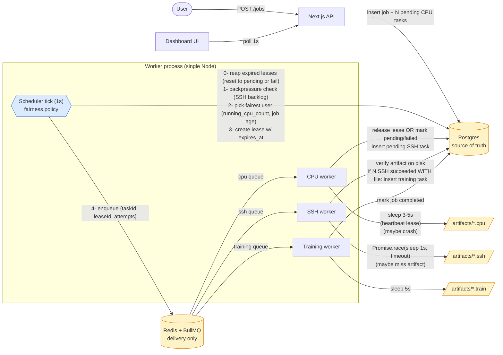

# Workflow Lab — Specification

## 1. Objective

Build a simulated job-orchestration system that demonstrates **fair multi-user scheduling** under a bounded global resource pool. The point is not the work itself (CPU / SSH / training are all simulated with `sleep` + fake files) — the point is to learn how a scheduler enforces fairness across users when a single FIFO queue would not.

**Target user:** one developer (the author) using this as a learning lab to understand the separation between *queue as delivery mechanism* and *scheduler as policy*.

**Problem solved:** when user A submits 200 tasks before user B submits 1 task, naive FIFO means B waits behind 200 of A's tasks. This system shows how to make B's task interleave fairly.

---

## 2. Scope (one feature only)

A user submits a **job**. The system produces **N pipelines per job** (default 200, configurable via `PIPELINES_PER_JOB` env var). Each pipeline is:

```
CPU task ──→ SSH-like task ──┐
CPU task ──→ SSH-like task ──┤
   ... (N of these) ...      ├──→ (barrier: all N SSH done) ──→ Training task ──→ Job done
CPU task ──→ SSH-like task ──┘
```

Out of scope: real SSH, real ML training, retries, auth, persistence beyond Postgres, horizontal worker scaling, autoscaling, priority tiers.

---

## 3. Architecture

### 3.1 Components

| Component | Responsibility |
|---|---|
| **Next.js app** | API routes (`/api/jobs`, `/api/jobs/:id`) + dashboard UI |
| **Postgres** | Source of truth: `users`, `jobs`, `tasks`, `artifacts`, `leases` |
| **Redis + BullMQ** | Execution delivery only — `cpu`, `ssh`, `training` queues |
| **Scheduler** | Periodic loop: picks pending tasks fairly, creates leases, enqueues to BullMQ |
| **Worker process** | Single Node process running BullMQ workers for all three queues |



Key separation: **DB holds policy state (pending tasks, leases)**; **Redis only delivers already-decided work**. The scheduler is the single point where fairness is enforced.

### 3.2 Critical design rule

**DB is source of truth. BullMQ is delivery, not policy.**

Do NOT enqueue all `PIPELINES_PER_JOB` CPU tasks at job-creation time. Tasks live in DB as `pending`. The scheduler decides who enters the queue.

```
POST /jobs                 →  insert job + N pending CPU tasks in DB (N = PIPELINES_PER_JOB)
scheduler tick (every 1s)  →  find active users → pick user with fewest running tasks
                              → pick one of their pending CPU tasks → create lease
                              → enqueue to BullMQ cpu queue
cpu worker                 →  sleep 3-5s → write artifact file → release lease
                              → insert pending SSH task in DB
ssh worker                 →  sleep 1s → write result file → release lease (if SSH leased)
                              → if all N SSH results exist for the job → insert training task
training worker            →  sleep 5s → mark job done
```

### 3.3 Fairness algorithm

Two distinct counts (do not confuse them):

- `used` — **global**: total active CPU leases across all users. Gates how many slots are free this tick.
- `running_cpu_count(u)` — **per-user**: that user's active CPU leases. Used only to rank users for the next slot.

Relationship: `used = Σ running_cpu_count(u)` over all users.

```
GLOBAL_CPU_SLOTS = 20

every 1s (single scheduler instance — see §3.9):
  reap_expired_leases()                  // §3.6
  if ssh_backlog >= SSH_BACKPRESSURE_THRESHOLD: skip CPU dispatch  // §3.8

  used = count(leases where resource='cpu' and released_at is null)
  free = GLOBAL_CPU_SLOTS - used
  if free <= 0: return

  for _ in range(free):
    -- one SQL: pick user + their oldest pending task in one go
    SELECT t.id AS task_id, t.user_id, j.created_at AS job_created_at,
           (SELECT count(*) FROM leases l
              WHERE l.user_id=t.user_id AND l.resource='cpu' AND l.released_at IS NULL
           ) AS running_cpu_count
      FROM tasks t
      JOIN jobs j ON j.id = t.job_id
      WHERE t.kind='cpu' AND t.status='pending'
      ORDER BY running_cpu_count ASC, j.created_at ASC, t.created_at ASC
      LIMIT 1
      FOR UPDATE OF t SKIP LOCKED;

    if no row: break
    INSERT lease (task_id, user_id, resource='cpu', expires_at=now()+LEASE_TTL_MS)
    UPDATE task SET status='queued'
    COMMIT
    bullmq.cpu.add({ taskId, leaseId, attempts: task.attempts })   // outside tx
```

**Tie-break order**:
1. Smaller `running_cpu_count` (fairness across users).
2. Smaller `jobs.created_at` of the candidate task's job (older job wins — fairness across the same user's queued jobs).
3. Smaller `tasks.created_at` (FIFO within a job).

**Within-user FIFO**: a single user's tasks are processed in `created_at` order across their jobs (earliest job's tasks drain before later jobs). This is intentional — fairness is across users, not across one user's own backlog.

**Crash safety of dispatch**: if the scheduler process dies between `COMMIT` and `bullmq.cpu.add`, the task is left as `status='queued'` with an active lease but no BullMQ message. The lease will expire after `LEASE_TTL_MS`, the reaper resets to `pending`, and the next tick re-dispatches. No special handling needed.

SSH tasks: same pattern with `GLOBAL_SSH_SLOTS` (default 40). Training tasks: `GLOBAL_TRAINING_SLOTS` (default 4). SSH and training dispatch are **not** affected by the CPU backpressure gate.

### 3.4 Data model

```sql
users        (id, name, created_at)

jobs         (id, user_id, status, pipelines_count,
              created_at, completed_at)
              -- status: 'pending' | 'running' | 'completed' | 'failed'
              -- pipelines_count: snapshot of PIPELINES_PER_JOB at job creation.
              --                  Barrier compares against this, not the live env var.

tasks        (id, job_id, user_id, kind, status, parent_task_id,
              attempts, max_attempts, failure_reason,
              created_at, started_at, finished_at)
              -- kind: 'cpu' | 'ssh' | 'training'
              -- status: 'pending' | 'queued' | 'running' | 'succeeded' | 'failed'
              -- attempts: int, default 0; incremented atomically when a worker claims it
              -- max_attempts: int, default 3
              -- failure_reason: nullable text ('crash' | 'timeout' | 'missing_artifact' | ...)
              -- UNIQUE INDEX (parent_task_id) WHERE kind='ssh'
              --   → guarantees at most one SSH child per CPU parent (§E1)

artifacts    (id, task_id, path, created_at)
              -- UNIQUE (task_id) → at most one artifact per task; barrier counts this table

leases       (id, task_id, user_id, resource,
              acquired_at, heartbeat_at, expires_at, released_at)
              -- resource: 'cpu' | 'ssh' | 'training'
              -- expires_at: now() + LEASE_TTL_MS at acquisition; bumped by heartbeat
              -- a lease is "expired" when expires_at < now() AND released_at IS NULL
```

A pipeline is identified by chaining `parent_task_id`: SSH task's parent = its CPU task; training task has no parent (gated by job-level barrier).

**Why `artifacts` has `UNIQUE (task_id)`**: a retried task (e.g. training that timed out and got reset to pending) must not produce two artifact rows. The second insert fails → optimistic-lock branch handles it (see §3.7).

**Why `jobs.pipelines_count`**: changing `PIPELINES_PER_JOB` between jobs would otherwise corrupt the barrier comparison for in-flight jobs. Snapshot at creation is the only safe option.

### 3.5 Barrier check

The `artifacts` table is the single source of truth for "did this SSH task actually produce a result". The SSH worker only inserts an `artifacts` row **after** verifying the file exists on disk (§3.7). Therefore the barrier never needs to do filesystem IO inside a DB transaction — it just counts artifact rows.

When an SSH task transitions to `succeeded` (i.e. the artifact row was just inserted), in the same DB transaction:

```sql
BEGIN;
  -- serialise concurrent finishers of the same job
  SELECT pipelines_count FROM jobs WHERE id = $jobId FOR UPDATE;

  done := SELECT count(*) FROM artifacts a
            JOIN tasks t ON t.id = a.task_id
            WHERE t.job_id = $jobId AND t.kind = 'ssh';

  IF done = jobs.pipelines_count
     AND NOT EXISTS (SELECT 1 FROM tasks WHERE job_id=$jobId AND kind='training') THEN
    INSERT INTO tasks (job_id, user_id, kind, status, max_attempts)
    VALUES ($jobId, $userId, 'training', 'pending', $MAX_ATTEMPTS);
  END IF;
COMMIT;
```

`FOR UPDATE` on the job row, plus the `NOT EXISTS` guard, makes training-task insertion idempotent under concurrent SSH finishers.

**On-disk verification** is the SSH worker's job (§3.7), not the barrier's. Splitting them this way keeps the barrier transaction pure SQL — no filesystem IO inside a DB lock.

### 3.6 Lease lifecycle & reaper

Leases are how the scheduler counts "currently running" without trusting workers to be alive.

- **Acquire**: scheduler creates lease with `expires_at = now() + LEASE_TTL_MS` (default 30s).
- **Heartbeat**: worker updates `heartbeat_at = now(), expires_at = now() + LEASE_TTL_MS` every `LEASE_HEARTBEAT_MS` (default 5s) while the task is running.
- **Release**: worker sets `released_at = now()` on success or graceful failure.
- **Reap**: each scheduler tick, before dispatching, run:
  ```sql
  -- expired leases = worker crashed or hung
  SELECT task_id FROM leases
    WHERE released_at IS NULL AND expires_at < now()
    FOR UPDATE SKIP LOCKED;
  -- for each: mark task back to pending if attempts < max_attempts, else failed.
  --          set lease.released_at = now() with a marker.
  ```

The reaper runs in the same scheduler tick — no separate process. This keeps "policy" in one place.

### 3.7 Failure semantics

Every worker wraps its handler in this skeleton. The key idea: the worker **claims** the task atomically using the `leaseId` it received via the BullMQ message. If the claim fails (e.g. reaper already reset this task and a new lease was issued), the worker silently aborts — no writes, no side effects.

```ts
// BullMQ payload: { taskId, leaseId, attempts: expectedAttempts }
async function runTask({ taskId, leaseId, attempts: expectedAttempts }, kind) {
  // 1. Atomic claim. The compound WHERE makes this a no-op if:
  //    - task was already reset by reaper (status != 'queued')
  //    - task already claimed by a parallel worker (attempts moved on)
  //    - lease was already released (someone else won)
  const claim = await db.query(`
    UPDATE tasks
       SET status='running', started_at=now(), attempts=attempts+1
     WHERE id=$1 AND status='queued' AND attempts=$2
       AND EXISTS (SELECT 1 FROM leases
                   WHERE id=$3 AND task_id=$1 AND released_at IS NULL)
     RETURNING attempts
  `, [taskId, expectedAttempts, leaseId])
  if (claim.rowCount === 0) return  // stale message, abort cleanly

  const myAttempts = claim.rows[0].attempts
  startHeartbeat(leaseId)           // setInterval: UPDATE leases SET expires_at=now()+TTL WHERE id=leaseId AND released_at IS NULL

  try {
    await Promise.race([
      doWork(taskId),               // sleep + write file (chaos may inject crash/timeout/skip-write)
      timeoutAfter(TASK_TIMEOUT_MS[kind]),
    ])

    // Verify on-disk artifact BEFORE inserting artifact row (filesystem IO outside tx).
    if (kind !== 'training') {
      const path = artifactPath(taskId, kind)
      await fs.access(path)         // throws → caught below
    }

    await db.tx(async (tx) => {
      // Optimistic lock: only proceed if our attempt is still authoritative.
      const upd = await tx.query(`
        UPDATE tasks SET status='succeeded', finished_at=now()
         WHERE id=$1 AND attempts=$2 AND status='running' RETURNING id
      `, [taskId, myAttempts])
      if (upd.rowCount === 0) throw new StaleAttemptError()  // rollback, no side effects

      await tx.query(`INSERT INTO artifacts (task_id, path) VALUES ($1, $2)
                      ON CONFLICT (task_id) DO NOTHING`, [taskId, path])
      await tx.query(`UPDATE leases SET released_at=now() WHERE id=$1`, [leaseId])

      if (kind === 'cpu')      await insertChildSshTask(tx, taskId)        // ON CONFLICT DO NOTHING via UNIQUE (parent_task_id)
      if (kind === 'ssh')      await runBarrierCheck(tx, jobId, userId)    // §3.5
      if (kind === 'training') await markJobCompleted(tx, jobId)           // UPDATE WHERE status != 'completed'
    })
  } catch (err) {
    if (err instanceof StaleAttemptError) return  // already handled

    await db.tx(async (tx) => {
      const reason = err.kind ?? 'error'         // 'timeout' | 'missing_artifact' | ...
      const retryable = myAttempts < task.max_attempts
      const upd = await tx.query(`
        UPDATE tasks
           SET status = $2,
               failure_reason = $3,
               finished_at = $4
         WHERE id=$1 AND attempts=$5 AND status='running' RETURNING id
      `, [taskId,
          retryable ? 'pending' : 'failed',
          reason,
          retryable ? null : 'now()',
          myAttempts])
      if (upd.rowCount === 0) return              // reaper got there first; nothing to do

      await tx.query(`UPDATE leases SET released_at=now() WHERE id=$1 AND released_at IS NULL`, [leaseId])

      // Permanent failure of any leaf task fails the whole job (§E4).
      if (!retryable) {
        await tx.query(`UPDATE jobs SET status='failed', completed_at=now()
                        WHERE id=$1 AND status NOT IN ('completed','failed')`, [jobId])
      }
    })
  } finally {
    stopHeartbeat(leaseId)
  }
}
```

A worker process **crash** (`process.exit`) skips both branches; the lease's `expires_at` is no longer being heartbeated; the reaper claims it on the next tick and resets the task to `pending` (or `failed` if attempts exhausted).

**Why the optimistic lock matters**: without `WHERE attempts=$myAttempts`, a slow worker could overwrite a task that has already been reset by the reaper and re-dispatched to a second worker — producing duplicate artifacts and duplicate SSH children.

**Job failure propagation**: when any CPU/SSH/training task hits permanent `failed`, the job is marked `failed` immediately. Other tasks of the same job that are already running are allowed to finish naturally (no cancellation) — they just won't trigger the barrier.

### 3.8 Backpressure (CPU → SSH)

CPU tasks produce SSH tasks. If SSH workers are slow or `GLOBAL_SSH_SLOTS` is small, SSH pending tasks pile up. The scheduler must not blindly keep producing more.

Before dispatching CPU tasks each tick:

```ts
ssh_backlog = SELECT count(*) FROM tasks
              WHERE kind='ssh' AND status IN ('pending','queued','running')
if ssh_backlog >= SSH_BACKPRESSURE_THRESHOLD:
  skip CPU dispatch this tick   // SSH queue still drains independently
```

`SSH_BACKPRESSURE_THRESHOLD` default: `2 × GLOBAL_SSH_SLOTS` (e.g. 80). SSH and training scheduling are unaffected — only CPU is paused.

**Trade-off (intentional)**: backpressure is **global**, not per-user. If alice's SSH tasks fill the backlog, carol's CPU tasks are also paused even though carol isn't responsible. This sacrifices strict fairness for system stability. If we let carol push more CPU tasks while the SSH queue is jammed, SSH backlog grows unbounded and breaks every user. Stability wins.

### 3.9 Single-instance guarantee

The fairness, reaper, and backpressure logic all assume **exactly one scheduler instance** is ticking. Two parallel schedulers would compute `used` independently and over-allocate slots.

On worker process startup, before the first scheduler tick:

```sql
SELECT pg_try_advisory_lock(hashtext('workflow-lab:scheduler'));
```

If the lock is not acquired, the process logs an error and exits 1. The lock is automatically released when the connection closes (process death). This makes "single scheduler" a runtime invariant, not a polite assumption.

BullMQ workers themselves can be multiple within the same process — only the scheduler tick must be singular.

### 3.10 BullMQ lock alignment

BullMQ has its own `lockDuration` (default 30s): if a worker holds a job longer than this, BullMQ assumes it died and re-delivers the job to another worker. If our task timeouts approach or exceed `lockDuration`, we get **double delivery** — same problem as a stale-message replay.

Set BullMQ `lockDuration` ≥ `max(*_TIMEOUT_MS) + 5000` (e.g. 70s for a 60s training timeout). Workers extend the BullMQ lock alongside the DB lease heartbeat. Our atomic claim (§3.7) is the safety net if alignment is wrong, but alignment is the first line of defence.

---

## 4. API

| Method | Path | Body | Returns |
|---|---|---|---|
| `POST` | `/api/users` | `{ name: string }` | `{ id, name }` |
| `POST` | `/api/jobs` | `{ userId: string }` | `{ jobId, status: 'pending', pipelinesCount }` |
| `GET`  | `/api/jobs/:id` | — | `{ id, userId, status, pipelinesCount, progress: { cpu: {done,total,failed}, ssh: {done,total,failed}, training: {done,total,failed} } }` |
| `GET`  | `/api/jobs` | query: `userId?` | list of jobs with progress |
| `GET`  | `/api/users` | — | list with running task counts (for dashboard fairness view) |

**Validation (zod)**:
- `POST /api/jobs`: `userId` must reference an existing user → 404 if not found. No auto-create.
- `PIPELINES_PER_JOB` is read at job-creation time and snapshotted into `jobs.pipelines_count`. Allowed range: `1 ≤ N ≤ 1000`. Reject with 400 if out of range.

User identity: `userId` passed in request body / query. No auth.

---

## 5. Frontend dashboard

One page (`/`):
- Form: pick user (or create new) → submit job
- Live table of jobs with progress bars (CPU / SSH / training counts)
- Live "fairness panel": running CPU task count per user, current global slot usage (e.g. `14/20`)
- Polling-based refresh (every 1s). No websockets.

Production-quality enough to read at a glance; not pixel-perfect.

---

## 6. Project structure

```
workflow-lab/
  app/                      # Next.js app router
    api/
      jobs/
        route.ts            # POST, GET list
        [id]/route.ts       # GET one
      users/route.ts
    page.tsx                # dashboard
    components/
  lib/
    db.ts                   # postgres client (pg or prisma)
    queues.ts               # BullMQ queue definitions
    scheduler.ts            # fairness loop (importable; runs in worker process)
    barrier.ts              # all-200-SSH-done check
    config.ts               # env-driven knobs
  worker/
    index.ts                # boots scheduler tick + 3 BullMQ workers
    cpu.ts
    ssh.ts
    training.ts
  db/
    schema.sql              # initial DDL
    migrations/             # if needed
  artifacts/                # fake output files written here (gitignored)
  docker-compose.yml        # postgres + redis
  package.json
  SPEC.md
  README.md
```

Two processes at runtime:
1. `next dev` (or `next start`) — serves API + UI
2. `node worker/index.ts` — runs scheduler loop + BullMQ workers

---

## 7. Configurable parameters (env)

```
GLOBAL_CPU_SLOTS=20
GLOBAL_SSH_SLOTS=40
GLOBAL_TRAINING_SLOTS=4

CPU_SLEEP_MIN_MS=3000
CPU_SLEEP_MAX_MS=5000
SSH_SLEEP_MS=1000
TRAINING_SLEEP_MS=5000

PIPELINES_PER_JOB=200            # snapshotted onto jobs.pipelines_count at creation; range 1..1000
SCHEDULER_TICK_MS=1000

# Lease / heartbeat
# TTL must be a comfortable multiple of the heartbeat interval (here 6×). A live worker
# bumps expires_at every LEASE_HEARTBEAT_MS, so task duration can exceed TTL safely as
# long as heartbeats keep firing. Reaper only kicks in when heartbeats stop.
LEASE_TTL_MS=30000
LEASE_HEARTBEAT_MS=5000

# Per-kind timeouts (used by Promise.race in worker)
CPU_TIMEOUT_MS=15000
SSH_TIMEOUT_MS=5000
TRAINING_TIMEOUT_MS=60000

# BullMQ lock duration (must be >= max(*_TIMEOUT_MS) + 5000 to avoid double-delivery, §3.10)
BULLMQ_LOCK_DURATION_MS=70000

# Retries
MAX_ATTEMPTS=3

# Backpressure (CPU paused when SSH backlog exceeds this)
SSH_BACKPRESSURE_THRESHOLD=80

# Chaos knobs (default 0 = off; set to inject failures)
CHAOS_CPU_CRASH_RATE=0.10        # 10% of CPU tasks: process.exit mid-run
CHAOS_SSH_TIMEOUT_RATE=0.05      # 5% of SSH tasks: sleep past SSH_TIMEOUT_MS
CHAOS_SSH_MISSING_ARTIFACT_RATE=0.05  # 5% of SSH tasks: succeed without writing file

DATABASE_URL=postgres://...
REDIS_URL=redis://localhost:6379
ARTIFACTS_DIR=./artifacts
```

---

## 8. Code style

- **TypeScript strict mode** everywhere.
- Next.js **App Router** (not Pages Router).
- DB access via **`pg`** with hand-written SQL. No ORM. The lease/lock semantics are the point of this lab — they must be visible.
- Package manager: **pnpm**.
- **Single `package.json`** at repo root — Next.js app and worker share `lib/` directly. Not a workspace/monorepo. (Decision: the learning target is the scheduler, not build tooling. Easy to split later if needed.)
- No ORM-heavy abstractions in scheduler — the scheduler is the point of this exercise; keep its SQL readable.
- Worker code isolated under `worker/` — no Next.js / React imports there. May import from `lib/`.
- UI: **Tailwind CSS**. No component library.
- Errors: `console.error` + DB status update is fine. No structured logger needed.

---

## 9. Testing strategy

**No automated tests for this lab** (per user). Manual verification consists of one happy-path scenario plus five chaos scenarios. Each chaos scenario maps to one chaos env var; flip it on, run, observe.

### 9.0 Setup
1. `docker-compose up -d` (postgres + redis)
2. `psql -f db/schema.sql`
3. `pnpm worker` (terminal 1)
4. `pnpm dev` (terminal 2)
5. Open dashboard, create users alice/bob/carol.

### 9.1 Happy path (all chaos knobs = 0)
- Submit a job as alice. All 200 pipelines complete; one training artifact written; `jobs.status = completed`.

### 9.2 Scenario 1 — Worker crash (CPU)
- Set `CHAOS_CPU_CRASH_RATE=0.10`.
- Submit job. ~10% of CPU tasks will `process.exit(1)` mid-sleep (kills the whole worker → restart it manually, or use `nodemon`).
- **Expect**: leases of crashed tasks expire after `LEASE_TTL_MS`; reaper sets them back to `pending`; they're re-dispatched on a later tick. `attempts` increments. Job still completes.

### 9.3 Scenario 2 — SSH timeout
- Set `CHAOS_SSH_TIMEOUT_RATE=0.05`.
- ~5% of SSH tasks sleep past `SSH_TIMEOUT_MS`.
- **Expect**: `Promise.race` rejects with timeout; task marked `pending` (retryable) or `failed` (after `MAX_ATTEMPTS`). Worker is **not** stuck. Lease released cleanly. Job completes only if every SSH eventually succeeds.

### 9.4 Scenario 3 — Artifact missing
- Set `CHAOS_SSH_MISSING_ARTIFACT_RATE=0.05`.
- 5% of SSH tasks return without writing the result file.
- **Expect**: `verifyArtifact()` throws → task → retry. Even if a buggy worker bypassed verification, the **barrier check counts only SSH tasks with on-disk artifacts**, so training never starts prematurely.

### 9.5 Scenario 4 — Multi-user fairness
- Submit jobs from alice, bob, carol within ~2 seconds of each other.
- **Expect**: dashboard's fairness panel shows running CPU counts converging — no user is starved. Approximate steady state: each user gets ~`GLOBAL_CPU_SLOTS / active_users` slots (~6/6/7 split for 3 users at 20 slots).

### 9.6 Scenario 5 — Backpressure
- Lower `GLOBAL_SSH_SLOTS=5` and `SSH_BACKPRESSURE_THRESHOLD=15`.
- Submit a job. CPU tasks produce SSH tasks faster than 5 SSH slots can drain.
- **Expect**: once SSH backlog (pending+queued+running) hits 15, scheduler stops dispatching new CPU tasks; SSH catches up; CPU resumes. No unbounded growth of SSH `pending` count.

---

## 10. Boundaries

### Always do
- Treat the **DB as source of truth**. Tasks must never exist only in BullMQ.
- Acquire a **lease row** before enqueuing; release it when the task finishes. Leases are how slot-counting works.
- Use a DB transaction for: lease creation, status transitions, barrier check / training-task creation.
- Make all sleep durations, slot counts, timeouts, and chaos rates read from env / config.
- **Heartbeat the lease** while a task runs. A worker that cannot heartbeat is treated as dead.
- **Verify the artifact file on disk before inserting the artifact row.** The barrier counts artifact rows — never status alone.
- Wrap every worker handler in `Promise.race(work, timeout)`. No worker may block forever.
- Reaper logic lives **inside the scheduler tick**, not a separate process.
- **Atomic-claim** in workers: every worker handler's first DB write must be a conditional `UPDATE` keyed on `(taskId, status, attempts, leaseId)`. Stale messages must be silently ignored.
- **Optimistic-lock** in workers: every subsequent state change must include `WHERE attempts=$myAttempts`. If 0 rows updated, abort and don't write side effects.
- **Snapshot `pipelines_count` onto `jobs`** at creation time. The barrier compares against the row, not the live env var.
- **Single scheduler instance**: enforce via `pg_try_advisory_lock` on worker startup. Refuse to start if another holds it.
- **Mark the job `failed`** as soon as any leaf task hits permanent `failed` (attempts exhausted). Do not let jobs hang on barriers that can never fire.

### Ask first
- Adding a new dependency beyond: `next`, `react`, `react-dom`, `pg`, `bullmq`, `ioredis`, `zod`, `tailwindcss`, `typescript`, `tsx`.
- Adding priority tiers, per-user quotas, or deadline-aware scheduling.
- Splitting the worker into multiple processes (planned — see §13).
- Switching from single `package.json` to a pnpm workspace.
- Changing barrier semantics (e.g. allowing partial-success training).
- Cancelling already-running tasks on job failure. Default is "let them finish, ignore the result".

### Never do
- **Never enqueue all CPU tasks at job-creation time** (regardless of `PIPELINES_PER_JOB` value). That defeats the entire learning goal.
- Never use BullMQ priorities or BullMQ retries to substitute for the DB-driven retry/lease mechanism. Failures must flow through `tasks.status` + `attempts`.
- Never hold a DB transaction open across a BullMQ enqueue, a `sleep`, a `fs.access`, or any non-DB IO.
- Never bypass the lease — direct `queue.add` outside the scheduler is forbidden.
- Never trust `tasks.status='succeeded'` alone for the barrier — only the `artifacts` table counts.
- Never let a chaos knob default to non-zero. Chaos is opt-in per scenario.
- Never `INSERT` an SSH child task or training task without the corresponding `UNIQUE`/`NOT EXISTS` guard.
- Never let `LEASE_TTL_MS` be lower than `LEASE_HEARTBEAT_MS × 3` — startup hiccups would falsely reap healthy workers.
- Never let `BULLMQ_LOCK_DURATION_MS` be lower than `max(*_TIMEOUT_MS) + 5000` — see §3.10.
- No real SSH, no real GPU, no real model — sleep + touch a file.
- No auth, no rate limits, no production hardening — this is a lab.

---

## 11. Decisions log

- DB access: **raw `pg`**, no ORM.
- Package manager: **pnpm**.
- Layout: **single `package.json`** (not a workspace).
- UI: **Tailwind CSS**, no component library.
- Single scheduler enforced by Postgres advisory lock; multiple BullMQ workers within the same process are fine.
- Barrier counts the `artifacts` table, not filesystem state at barrier time.
- Job-level failure is propagated immediately on any leaf permanent failure; running siblings are not cancelled.
- Worker-crash chaos uses `process.exit(1)` (real crash). Restart via `nodemon` or `pnpm worker:watch`.
- BullMQ lock duration aligned with task timeouts — see §3.10.

---

## 12. Out of scope (acknowledged limitations)

These edge cases exist but are deliberately not addressed:

- **Rate limits on `POST /jobs`** — a single user can flood the system with jobs. Acceptable for a lab.
- **Redis or Postgres outage** — the system stops making progress; no degraded-mode fallback. Restart the dependency and it resumes.
- **Filesystem errors** (out of space, permission denied) — surface as worker exceptions; treated like any other failure with retry/fail.
- **Auth, CSRF, CORS, multi-tenancy isolation** — not relevant for a local lab.
- **Cancelling an in-flight job** (no `DELETE /api/jobs/:id`) — once submitted, jobs run to completion or failure.
- **Horizontal scaling** — single scheduler is enforced; no leader election across processes.
- **Drift in chaos rates over time** — chaos is per-task probability, not per-second rate. At low rates this can produce streaks. Acceptable for manual verification.

---

## 13. Planned change — multi-process scaling for CPU-bound work

**Status**: planned, not implemented. Current system keeps scheduler + all three BullMQ workers in one Node process (`worker/index.ts`). This section records the intended target shape so we don't lose context. Short term we keep the existing single-process layout.

### 13.1 Motivation

CPU tasks are currently simulated with `sleep` (I/O-bound), so a single Node event loop can multiplex them via `concurrency`. The lab is expected to evolve toward **real CPU-bound** CPU tasks (synchronous compute — matrix ops, hashing, etc.). At that point:

1. A single Node main thread can saturate **at most one core**, regardless of BullMQ `concurrency`.
2. Synchronous compute blocks the event loop, which **freezes the lease heartbeat (`startHeartbeat` setInterval) and BullMQ lock renewal** for the duration of the work. Side effects:
   - Lease `expires_at` slips past `now()` while the worker is busy → reaper resets the task to `pending` → BullMQ re-delivers to a second worker → duplicate execution + `StaleAttemptError` on the original finalize.
   - BullMQ `lockDuration` (currently aligned via `BULLMQ_LOCK_DURATION_MS`) cannot be extended in time → double-delivery on the BullMQ side as well.
   - `attempts` inflates against `MAX_ATTEMPTS`, eventually permanent-failing the task.

Scaling fan-out across the available cores (target: ~20) is therefore both a **throughput** problem and a **correctness** problem.

### 13.2 Target architecture

Two changes, complementary:

#### (a) Split `scheduler` and `worker` into separate process entries

`worker/index.ts` currently bundles three things: advisory-lock acquisition, scheduler tick loop, three BullMQ workers. Once we want N worker replicas, the advisory lock forces N−1 of them to exit (§3.9). So we split:

```
scheduler/index.ts   →  acquireSchedulerLock + runSchedulerLoop  (replicas = 1)
worker/index.ts      →  BullMQ workers only, role-selectable     (replicas = N)
```

`worker/index.ts` reads `WORKER_ROLE` from env and starts the appropriate workers:

| `WORKER_ROLE` | Workers started | `concurrency` | Replicas | Rationale |
|---|---|---|---|---|
| `cpu` | `cpu` only | **1** | ~`GLOBAL_CPU_SLOTS` (≈18–20) | one CPU-bound process per core |
| `io` | `ssh` + `training` | high (`SSH_WORKER_CONCURRENCY` / `TRAINING_WORKER_CONCURRENCY`) | 1–2 | I/O-bound; event loop multiplexes |

`package.json` gains:
```json
"scheduler":  "tsx --env-file=.env scheduler/index.ts",
"worker:cpu": "WORKER_ROLE=cpu tsx --env-file=.env worker/index.ts",
"worker:io":  "WORKER_ROLE=io  tsx --env-file=.env worker/index.ts"
```

`acquireSchedulerLock` is removed from the worker entry — only the scheduler process holds the lock. Worker processes do not need it (BullMQ + Redis already make `cpu`/`ssh`/`training` queue consumption atomic).

#### (b) Run actual CPU work in `worker_threads` inside each CPU worker process

This is independent of (a) and is **required as soon as `defaultCpuWork` becomes synchronous compute** — even with one process per core, blocking the main thread breaks the heartbeat and BullMQ lock renewal as described in §13.1.

Shape:

```
worker/cpu.ts          →  defaultCpuWork spawns worker_threads.Worker(cpu-thread.js),
                          awaits its message / exit.
                          On withTimeout rejection, terminate() the thread.
worker/cpu-thread.ts   →  runs the synchronous compute, writes the artifact,
                          parentPort.postMessage(artifactPath).
```

Effect: the BullMQ worker's main thread stays free to:
- run the `startHeartbeat` `setInterval` against the lease,
- service the BullMQ lock-renewal callback,
- honour `withTimeout` on `CPU_TIMEOUT_MS`.

`runCpuTask`'s atomic claim, optimistic lock, artifact verification, and finalize remain unchanged — only `doWork` moves to a thread.

### 13.3 Slot-cap re-tuning

When the architecture lands, re-evaluate config:

- `GLOBAL_CPU_SLOTS` should match the deployed count of `worker:cpu` processes (e.g. 18 if we leave 2 cores headroom for scheduler + IO worker + OS).
- `SSH_BACKPRESSURE_THRESHOLD` may need to scale with the larger CPU throughput, otherwise SSH backlog hits the gate too easily and CPU dispatch stalls.
- `BULLMQ_LOCK_DURATION_MS` and `LEASE_TTL_MS` interact with worker_threads: even with the thread split, set them generously (TTL ≥ heartbeat × 6 stays the right rule).

### 13.4 What does NOT change

- DB schema, fairness algorithm (§3.3), barrier (§3.5), reaper (§3.6), failure semantics (§3.7), backpressure logic (§3.8) — all single-instance scheduler invariants are preserved by the advisory lock living in the dedicated `scheduler/` process.
- Public API (§4) and dashboard (§5).
- BullMQ queue names and message shapes.
- Single `package.json` layout (§3 / §6) — no workspace split.

### 13.5 Sequencing (for future implementation)

In rough dependency order, not committed to phases yet:

1. **Move CPU-bound work to `worker_threads`** (no process split yet). This is also the prerequisite for `defaultCpuWork` ever being real compute. Owns its own correctness story (heartbeat + BullMQ lock renewal stay alive).
2. **Extract `scheduler/index.ts`** from `worker/index.ts`; add `WORKER_ROLE` switch in `worker/index.ts`; add `package.json` scripts.
3. **Process supervisor wiring** (pm2 / Docker Compose / systemd template) to run 1× scheduler, ~18× `worker:cpu`, 1–2× `worker:io`.
4. **Re-tune `GLOBAL_CPU_SLOTS` and `SSH_BACKPRESSURE_THRESHOLD`** against the new fan-out.
5. **Manual verification** that fairness (§9.5) and backpressure (§9.6) still hold under the multi-process layout.

Until these land, the existing single-process worker is the supported configuration.
