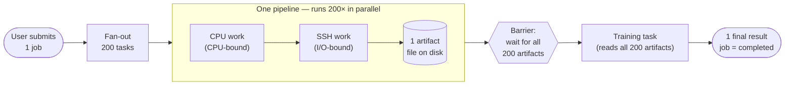

# What a job does

One submitted job fans out into **200 parallel pipelines**, then fans back in to **one training step** that produces a single final result.

## What each stage actually does

| Stage | Count per job | Work | Output |
|---|---|---|---|
| **CPU task** | 200 | CPU-bound compute (simulated by `sleep` inside a `worker_threads.Worker`, so the main thread can keep heartbeating) | Hands off to the SSH task for the same pipeline |
| **SSH task** | 200 | I/O-bound — emulates an SSH session that writes a file to disk | One artifact file at a deterministic path per `taskId` |
| **Barrier** | 1 per job | Counts on-disk artifacts and only fires once all 200 are present | Unblocks the training task |
| **Training task** | 1 | Reads all 200 artifacts and produces the final result | Job is marked `completed` |

The number 200 is configurable via `PIPELINES_PER_JOB` (range 1–1000). The default of 200 is what makes fairness interesting — large enough that one user's job can monopolise the slots, small enough to finish in a demo.

## Why "fake" work?

The CPU step is `sleep`. The SSH step is `sleep` + `touch`. The training step reads file existence, not file contents. **The work is intentionally fake** so that the only thing left to look at is the *machinery around the work*: how tasks get dispatched fairly, how crashes get detected, how the barrier holds the training step back without polling. That machinery is the actual subject of this lab.

For the design rationale of each piece (fairness ordering, lease/heartbeat/reaper, barrier semantics, transport split), see [`../03-design/`](../03-design/).

## Where each stage runs

- **CPU tasks** run in the `worker:cpu` process pool (one OS process per CPU slot — see [`process isolation`](../03-design/scheduler-vs-queue.md) and the spec's BullMQ-lock alignment section).
- **SSH and training tasks** run in the `worker:io` process pool, with higher in-process concurrency since they're I/O-bound.
- **The scheduler** (single instance, advisory-lock-guarded) decides *which* pending task fills each free slot, applying the 4-level fairness tie-break described in [`../03-design/dispatch-ordering.md`](../03-design/dispatch-ordering.md).

## Glossary in one breath

- **Job** — what a user submits. Owns 200 tasks plus the eventual training task.
- **Task** — one unit of work (a CPU task, an SSH task, or the training task).
- **Pipeline** — the CPU → SSH pair that produces one artifact.
- **Artifact** — a file on disk produced by the SSH step; the barrier counts these.
- **Lease** — DB-backed proof that a specific worker currently owns a specific task. Heartbeated while running; reaped on expiry.
