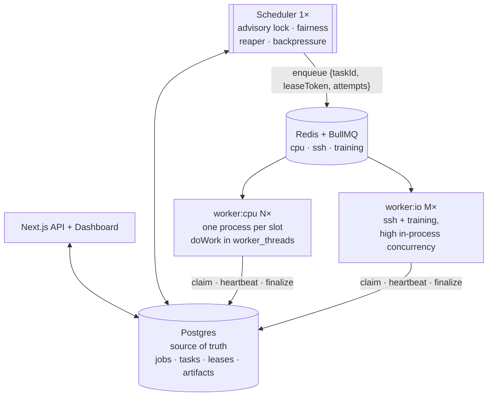

# Design

Deep-dives into *why* the scheduler is built this way. Each page is self-contained — read whichever one matches what you're trying to understand.

For a single-file, fully co-located spec (used by agentic workflows), see [`../../SPEC.md`](../../SPEC.md).

## Process-level architecture

**Key separation:** Postgres holds policy state (pending tasks, leases). Redis only delivers already-decided work. The scheduler is the single point where fairness is enforced — guaranteed by a Postgres advisory lock that exits any second scheduler at startup.

## Deep-dives

| Read this if you want to understand… | Page |
|---|---|
| The state machine of a single task and the "running → queued" puzzle | [`task-lifecycle.md`](./task-lifecycle.md) |
| Why dispatch state lives in Postgres rather than BullMQ — 4 architecture options compared | [`scheduler-vs-queue.md`](./scheduler-vs-queue.md) |
| Why the scheduler reserves a lease **before** publishing to BullMQ, and why this reduces the queue to a transport | [`dispatch-ordering.md`](./dispatch-ordering.md) |
| The three mechanisms that detect a dead vs. wedged worker, and why all three are needed | [`timeout-and-death.md`](./timeout-and-death.md) |

## Decisions (ADRs)

Architectural decisions with full context: [`../adr/`](../adr/).
