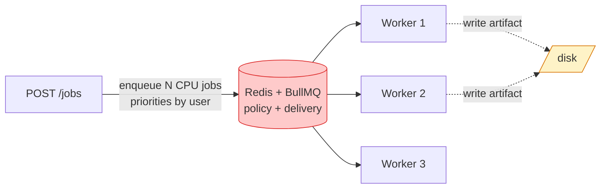
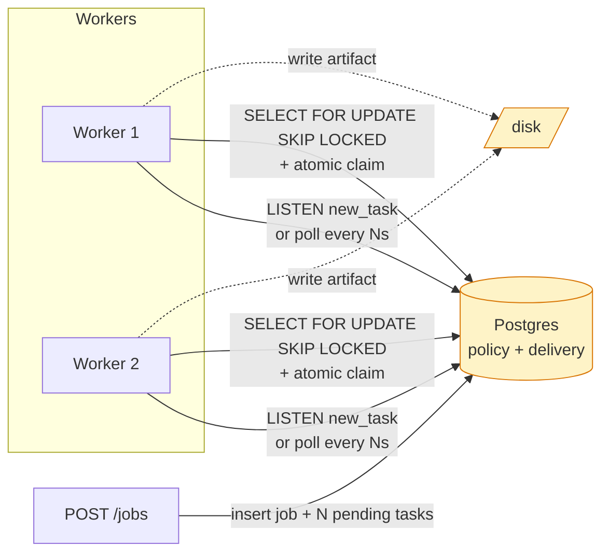
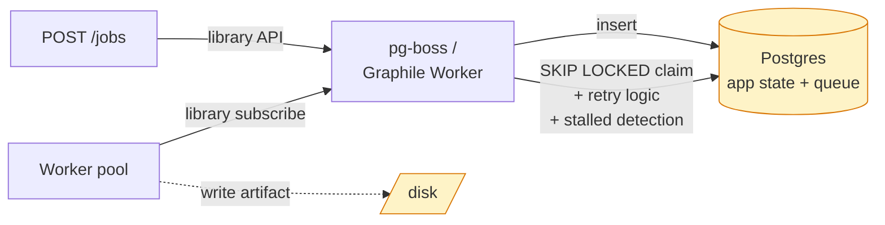
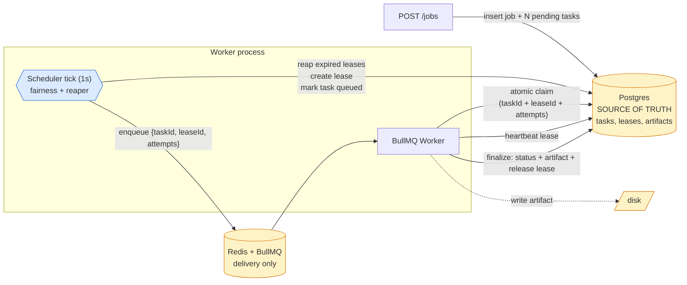

# Queue Architecture: Trade-offs

This doc compares four ways to wire a fair-scheduling job system. The `workflow-lab` codebase implements **Option D**; the rest are listed so the choice is visible, not silent.

The driving requirement is **fairness dispatching**, not just queueing. Three forces shape every option below:

- **Where does "what is currently running" live?** (the source of truth)
- **Who decides "what should run next"?** (policy)
- **How does the chosen task get into a worker's hands?** (transport)

---

## What "fairness dispatching" actually requires

Not FIFO, not "high priority first". The requirement: **K global slots, N active users with different pending-task backlogs; when a slot frees, pick a task belonging to whichever user is currently using the fewest slots, breaking ties by oldest job then oldest task.**

Three operations under the hood:

1. **Count** — for each user, count `running_count` (must be strongly consistent — a stale cache here means over-allocation).
2. **Rank** — order candidates by `(running_count ASC, job_created_at ASC, task_created_at ASC)`.
3. **Reserve** — atomically mark the chosen task `queued` and create a slot-counting record (a lease).

Every option below is judged on how cleanly it can do these three things. Most other quality differences (operational surface, latency) only matter once the option clears the fairness bar.

---

## Option A — BullMQ does everything

The naive starting point: enqueue every task at job-creation time, let BullMQ handle priorities and retries.



### Fairness

To get fairness you'd encode user identity into BullMQ priority: priority gets lower as the user's `running_count` rises. But:

- BullMQ priority is **fixed at enqueue time**. If alice queues 200 tasks at priority=10 before bob queues 1 at priority=10, alice still drains first — exactly the failure mode this lab exists to prevent.
- To "rerank" you'd dequeue, recompute, re-enqueue — a race-condition factory.
- BullMQ has no atomic `count(*) WHERE user=X AND running` primitive. You'd build a Redis counter alongside and pay the consistency tax yourself.
- Priority is one-dimensional. `(running_count, job_created_at, task_created_at)` doesn't fit.
- Slot pools are not native — only per-queue worker concurrency. "20 CPU slots split fairly across users" requires reinventing a scheduler on top.

### Other pros / cons

- ✅ One operational component.
- ✅ BullMQ stalled-job recovery, retries, dashboards work out of the box.
- ❌ BullMQ retries / priorities can't substitute for a real fairness mechanism without rebuilding it.

**Verdict:** unsuitable for fairness. Acceptable only when "fairness" really means "best-effort priority" and you don't need slot pools or cross-queue backpressure.

---

## Option B — Postgres does everything

Skip Redis entirely. Workers `LISTEN/NOTIFY` or poll, claim with `SELECT … FOR UPDATE SKIP LOCKED`.



### Fairness

Count + Rank + Reserve fit into one query:

```sql
SELECT t.id, t.user_id
  FROM tasks t
  JOIN jobs j ON j.id=t.job_id
 WHERE t.kind='cpu' AND t.status='pending'
 ORDER BY (SELECT count(*) FROM leases l
            WHERE l.user_id=t.user_id AND l.resource='cpu' AND l.released_at IS NULL) ASC,
          j.created_at ASC, t.created_at ASC
 LIMIT 1
 FOR UPDATE OF t SKIP LOCKED;
```

Then `INSERT lease`, `UPDATE task SET status='queued'`, `COMMIT` — all in one transaction.

- `running_count` is read live from `leases`. No cache to keep coherent.
- Adding more sort keys (deadline, per-user quota, per-job fairness) is just SQL — no priority-encoding gymnastics.
- Multi-worker contention handled by `SKIP LOCKED` + `FOR UPDATE`. Running one scheduler vs many is a policy choice (advisory lock), not a forced limitation.
- Atomic across all three steps in a single tx — no "I thought A had 5, but really 6" race.

The correlated subquery in `ORDER BY` is fine at lab scale; at high task volumes you'd preaggregate into a `LEFT JOIN ... GROUP BY` shape.

### Other pros / cons

- ✅ One source of truth. No two-timeout alignment problem (no `BULLMQ_LOCK_DURATION_MS` vs `LEASE_TTL_MS`).
- ✅ Crash semantics simpler: process death = lock released = next worker claims. No stale-message branch.
- ❌ Worker pickup latency = poll interval (or `LISTEN/NOTIFY` integration cost).
- ❌ Hot path is Postgres row locks; at high throughput you contend earlier than Redis would.
- ❌ Worker pool, retry, scheduling UI all DIY.

**Verdict:** the cleanest option for fairness specifically. For many real systems at this lab's scale, this is also the operationally simplest choice — the "delivery" abstraction Redis provides isn't earning its complexity until you have many workers across many machines pulling at low latency.

---

## Option C — Postgres-native job queue library

The "don't reinvent" version of B. Use `pg-boss`, `Graphile Worker`, `river`, or similar.



### Fairness

The library gives you a queue, not a scheduler. Its built-in ordering is priority + scheduled_at — same one-dimensional limit as A.

To get fairness, **don't use the library's enqueue API for the fair-scheduled work**. Instead:

1. Insert all tasks into your own `tasks` table as `pending`.
2. A scheduler tick runs the same fairness SQL as Option B and picks top-K.
3. Hand those task IDs to the library's worker pool (its enqueue API), one by one.

You're using the library as "worker pool + retry wrapper" while doing your own scheduling. The fairness SQL itself is identical to B — no loss there.

### Other pros / cons

- ✅ No custom worker pool, heartbeat, retry code.
- ✅ Single store. App state and queue state can co-transact.
- ❌ Hybrid mental model: "we have a library queue but skip its scheduling." A reader has to learn why.
- ❌ Library's prefetch / batching may slightly disturb fairness (worker may already hold the next task before scheduler finalises rank). Usually small but real.
- ❌ Same Postgres-as-bottleneck consideration as B at scale.

**Verdict:** viable but awkward when fairness is the dominant requirement — the library earns its keep on retry/dashboard, not on scheduling, and scheduling is most of the code in a fair system. For systems where retries and ops dashboards matter more than scheduling sophistication, this is the right default.

---

## Option D — Postgres truth + BullMQ delivery (this lab's design)

DB owns policy and state. BullMQ is a transport that announces "this specific task is ready right now, go pull it."



### Fairness

Identical SQL to Option B — same correlated-subquery rank, same `FOR UPDATE SKIP LOCKED`, same single-tx Count + Rank + Reserve. BullMQ does not see the `tasks` table, does not influence rank, does not hold counters. It is fully transparent to fairness.

The single-instance scheduler invariant (Postgres advisory lock) makes Count + Rank + Reserve a single-writer operation, eliminating scheduler-vs-scheduler races.

The only fairness-side concern is the crash window: scheduler dies after `COMMIT lease` but before `bullmq.add` → that user's `running_count` is briefly inflated until the lease reaper recovers it. Bounded by `LEASE_TTL_MS`.

### Other pros / cons

- ✅ Same fairness flexibility as B.
- ✅ Lower worker pickup latency than B/C — workers block on Redis pop instead of polling Postgres.
- ✅ Forces clean policy/transport separation. The discipline of "never query BullMQ for application state" is the learning goal.
- ✅ BullMQ dashboard / cron / delayed-jobs available for non-fair workloads (cleanups, etc.).
- ❌ **Two timeouts to align.** `BULLMQ_LOCK_DURATION_MS >= max(*_TIMEOUT_MS) + 5000` or BullMQ re-delivers a still-running task. Boot-time validation required.
- ❌ **Two failure-detection paths.** BullMQ's stalled-checker handles "worker died inside Redis's view"; DB lease + reaper handles "worker died after claiming". Both must exist.
- ❌ Two operational stores; two outage modes.

**Verdict:** correct for this lab — the policy/transport split is the lesson. For production, prefer C unless Redis is already in the stack and worker fan-out latency matters.

---

## Fairness comparison (the deciding axis)

| Capability | A: BullMQ | B: PG only | C: pg-boss / Graphile | D: PG truth + BullMQ |
|---|---|---|---|---|
| Live `running_count` per user | ❌ static priority | ✅ `count(leases)` | ✅ same as B | ✅ same as B |
| Multi-key rank `(running_count, job_age, task_age)` | ❌ one-dimensional | ✅ SQL ORDER BY | ✅ | ✅ |
| Atomic Count + Rank + Reserve | ❌ | ✅ single tx | ✅ | ✅ |
| Slot pools (global + per-kind) | ❌ DIY | ✅ `count(leases)` | ✅ | ✅ |
| Cross-kind backpressure (CPU paused on SSH backlog) | ❌ no global view | ✅ one query | ✅ | ✅ |
| Adding new fairness rules later | ❌ rebuild | ✅ SQL edit | ✅ | ✅ |
| Worker pickup latency | low | medium (poll/LISTEN) | medium | low |
| Fairness code you must write | very high (rebuild scheduler in priority space) | medium (worker pool + retry) | low (worker pool comes free) | low |

**Take-aways:**

- **A is the only option that fails the fairness bar.** Its priority model is incompatible — making it work means rebuilding a scheduler outside BullMQ, at which point BullMQ adds nothing.
- **B, C, D are equivalent on fairness.** They share the same fairness SQL. The difference is everywhere *else*: transport latency, library convenience, operational surface.
- **Choose between B/C/D on transport, not on scheduling.** Once you're committed to "DB owns rank", the question becomes "how do workers pick up the chosen task" — that's the only axis left.

---

## Other-axis comparison (after fairness is satisfied)

| Concern | A | B | C | D |
|---|---|---|---|---|
| Sources of truth | 1 (Redis) | 1 (PG) | 1 (PG) | 1 (PG) + 1 transport |
| Two-timeout alignment | n/a | n/a | n/a | ⚠️ required |
| Operational components | 1 (Redis) | 1 (PG) | 1 (PG) | 2 (PG + Redis) |
| Survives Redis loss | ❌ | ✅ | ✅ | ✅ degraded; reaper rebuilds |
| Survives DB loss | ✅ in-flight only | ❌ | ❌ | ❌ |
| "Recommended for production" | only with priority-only fairness | small/medium scale | **default** | when Redis already in the stack |
| "Recommended for this lab" | no — defeats learning goal | viable, simpler | viable, hides SQL | **yes — teaches the split** |

---

## How to decide for a future system

1. **Do you need fairness across users (not FIFO + priority)?** If yes, rule out A.
2. **Is Postgres already your primary store and you don't yet have Redis?** C is the default.
3. **Do you need sub-second worker pickup at high throughput across many machines?** D's transport split earns its keep.
4. **Are you building this as a learning exercise on the policy/transport boundary?** D.

The trap to avoid: drifting from D to "BullMQ kind of owns state too" by reading from Redis in the wrong place. The discipline is **never query BullMQ for application state**. If you're tempted, you've crossed the line and should consider migrating to C.
